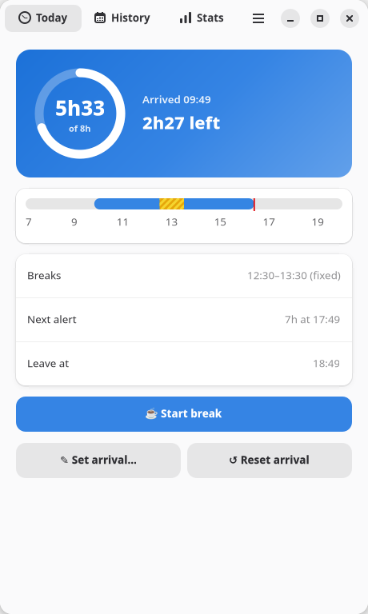
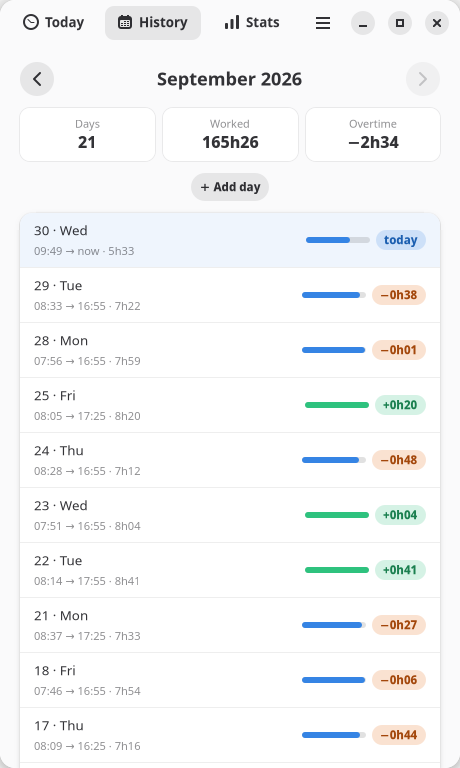
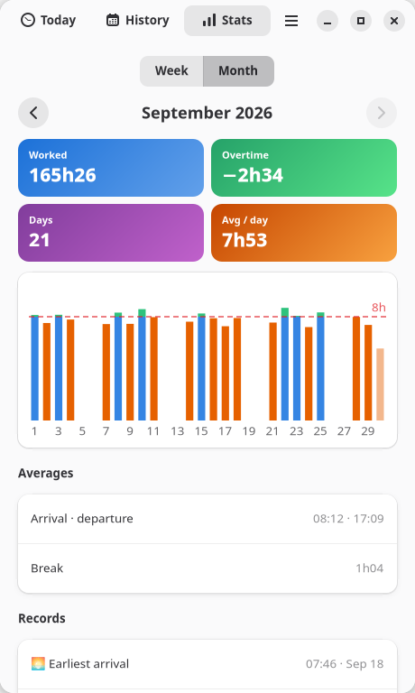
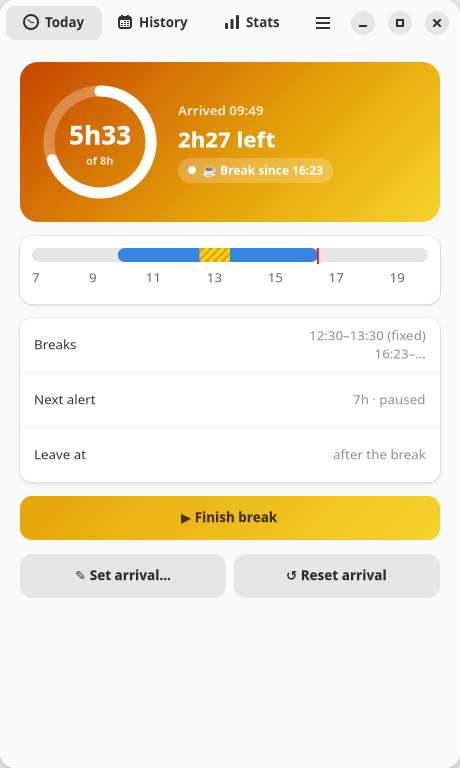
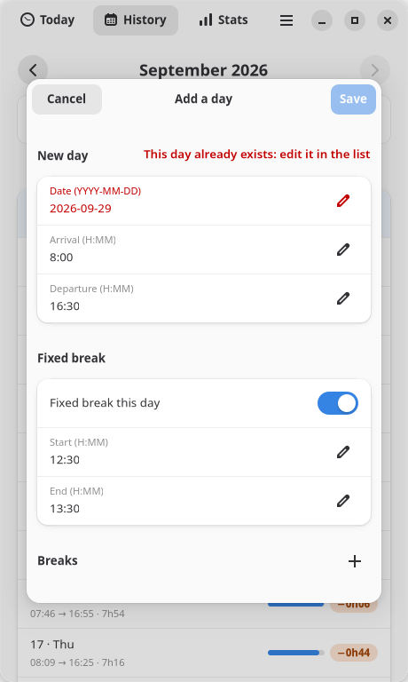

# Time Tracker

**Know how long you've been at the office, without thinking about it.**

Time Tracker is a GNOME Shell extension and a companion app. It starts counting when you switch your computer on, leaves your breaks out, tells you when you reach your milestones, and keeps a history and statistics of your working days.


<p align="center">
  
  
  
</p>

## Features

- **Automatic arrival:** your day starts when the computer is switched on, and a reboot later in the day doesn't reset it.
- **Top-bar counter:** `⏱ 5h12` while you work, and `☕ 5h12` during a break.
- **Breaks:** an optional fixed lunch break (12:30–13:30 by default), plus **Start break / Finish break** whenever you step away. A break still running survives a reboot.
- **Milestone alerts:** desktop notifications at 4h, 7h, 7h45 and 8h (all configurable). The last one stays on screen until you dismiss it. Alerts never repeat, and after time away you only get the latest one you missed.
- **Overtime:** how far above or below your daily target you are, for today and for every past day.
- **History:**
  - one entry per day with arrival, departure, breaks and time worked
  - edit a past day, or add one you forgot
- **Statistics:**
  - week or month totals
  - averages (arrival, departure, break length)
  - records (earliest arrival, longest day and more)
  - a bar chart of your days
- **Lightweight:** one timer a minute inside GNOME Shell, and no background program. The app only runs while its window is open.
- **Private:** everything stays on your computer in plain JSON files. There are no network requests and no accounts.

<p align="center">
  
  
</p>

## Requirements

- GNOME Shell **48** (for example Debian 13, Fedora 42, Ubuntu 25.04)
- GJS, GTK 4 and libadwaita **1.7** (installed with GNOME)
- `glib-compile-schemas` (part of GLib)

## Installation

```bash
git clone https://github.com/Fafafa12/time_tracker.git
cd time_tracker
./install.sh
```

Then **log out and back in** (on Wayland, GNOME Shell only loads new extensions at login), and enable the extension:

```bash
gnome-extensions enable time-tracker@anjrakot
```

`install.sh` only creates links in your home folder. It changes no system files and no GNOME settings:

| Installed | Location |
|---|---|
| Extension | `~/.local/share/gnome-shell/extensions/time-tracker@anjrakot` |
| `time-tracker` command | `~/.local/bin/time-tracker` |
| App-grid entry and icon | `~/.local/share/applications/`, `~/.local/share/icons/` |

The links point into the cloned folder, so keep it where it is. To update, run `git pull` and log out and back in.

## Usage

- **Top bar:** click the counter to see:
  - your arrival, time worked, and time remaining or overtime
  - the next alert
  - the actions: start or finish a break, open the app, reset the arrival, open the history folder, settings
- **Time Tracker app:** open it from the app grid, the top-bar menu, or the `time-tracker` command.
  - **Today:** progress towards your target, a timeline of the day, breaks, the next alert and when you can leave. You can also correct your arrival here.
  - **History:** browse month by month. Click a past day to edit it, or use **＋ Add day**.
  - **Stats:** switch between week and month, and go back to earlier periods.
- **Settings:** open them from the top-bar menu, the app's ☰ menu, or with `gnome-extensions prefs time-tracker@anjrakot`. You can set:
  - the alert times (the largest one is your daily target)
  - the fixed break and its alerts
  - the history folder

  The settings window also has a button to send a test notification.

## How time is counted

- **Worked time** = now − arrival − breaks. Overlapping breaks are counted once.
- **Arrival** = the time the computer was started that day. If it wasn't started that day (for example after waking from an overnight suspend), it's the moment the extension first runs.
- **Departure** = the last time the computer was on that day. It is saved every 5 minutes and when you lock the screen, log out or shut down.
- **Overtime** = worked time − target (8h by default). There's no running balance between days.

The full rules (catch-up alerts, midnight, settings changes) are in [docs/DESIGN.md](docs/DESIGN.md).

## Your data

History is kept in `~/.local/share/time_tracker/` (you can change this in the settings), one readable JSON file per month:

```json
"2026-09-30": {"arrival": "09:49:48", "departure": "18:02:10",
               "breaks": [["15:10:00", "15:25:00"]], "workedMin": 492, "overtimeMin": 12}
```

- Every write is atomic, so a file is never left half-written.
- A damaged file is kept as a timestamped `.bak` copy and never overwritten.
- You can back up or edit these files like any other file. If you edit today's arrival by hand, the tracker picks it up within 5 minutes.

## Uninstall

```bash
gnome-extensions disable time-tracker@anjrakot
rm ~/.local/share/gnome-shell/extensions/time-tracker@anjrakot \
   ~/.local/bin/time-tracker \
   ~/.local/share/applications/io.github.fafafa12.TimeTracker.desktop \
   ~/.local/share/icons/hicolor/scalable/apps/io.github.fafafa12.TimeTracker.svg
```

Your history in `~/.local/share/time_tracker/` is kept. Delete that folder too if you don't need it anymore.

## Development

```bash
gjs -m tests/run.js                        # unit tests (no GNOME session needed)
dev/preview.sh /tmp/tt-preview             # render the app's pages to PNG with sample data
dev/preview.sh /tmp/tt-preview --break     # …while on a break
dev/preview.sh /tmp/tt-preview --offline   # …with the extension off
journalctl --user -f -o cat /usr/bin/gnome-shell | grep time-tracker   # extension logs
```

- `dev/preview.sh` runs a fake tracker on a private D-Bus and draws the app off-screen, so it never touches your desktop, your settings or your real history.
- After changing the extension's code (`extension.js`, `lib/*.js`), log out and back in to reload it. The app and the settings window load fresh each time they are opened.
- Don't test with `gsettings set`, `gnome-extensions enable/disable` or a nested `gnome-shell`, because those write to your real GNOME configuration.

The architecture, data format, D-Bus interface and code map are described in [docs/DESIGN.md](docs/DESIGN.md).

## Known limitations

- If the computer stays on **and unlocked** past midnight, the next day starts at 00:00. Lock or suspend at night to avoid this.
- Time while the screen is locked counts as work.
- Only GNOME Shell 48 is supported for now.

See [docs/DESIGN.md](docs/DESIGN.md#known-limitations-and-follow-ups) for the full list.

## Contributing

Issues and pull requests are welcome. Please run `gjs -m tests/run.js` before sending a change, and use `dev/preview.sh` to check any change to the app's pages.
